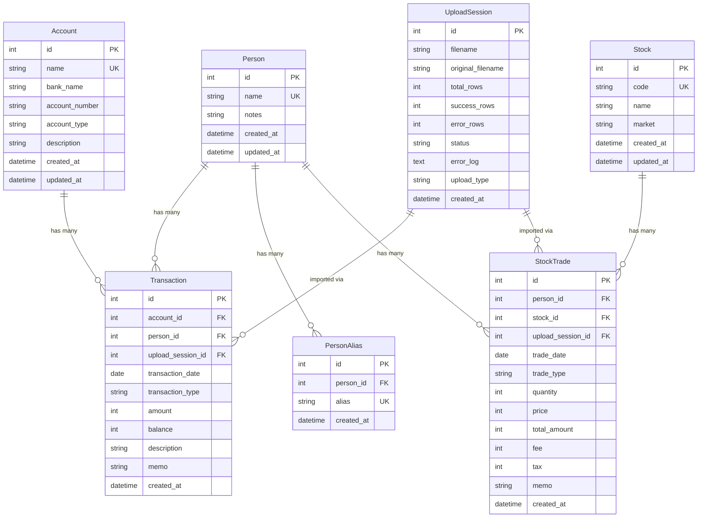
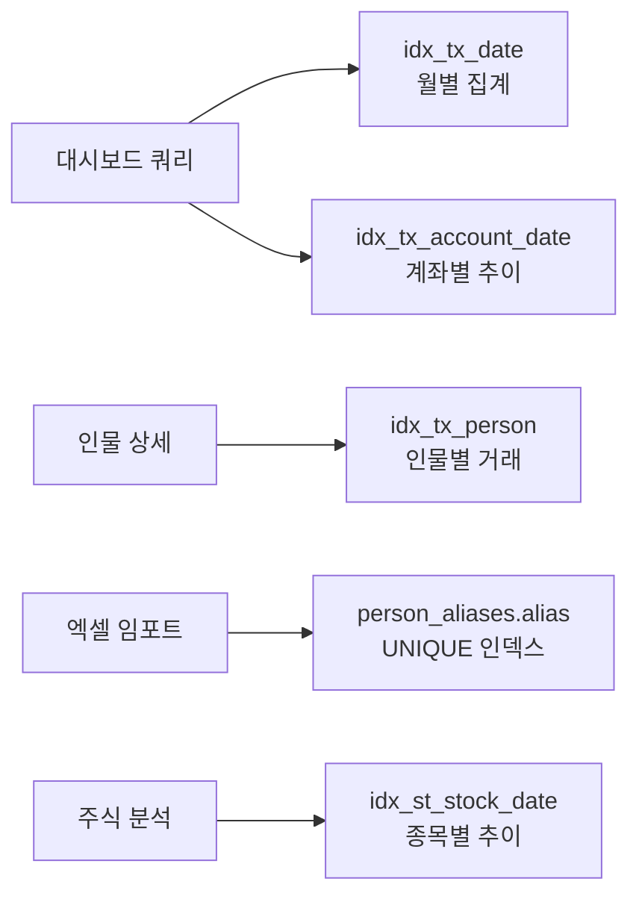
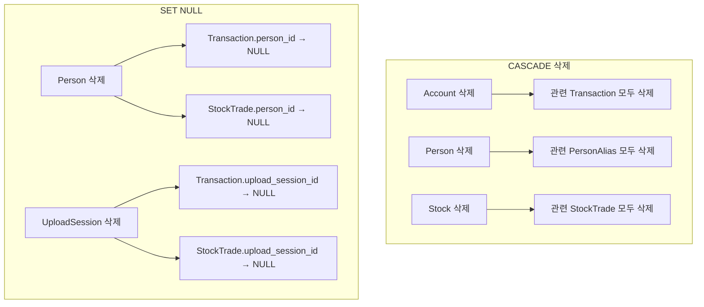
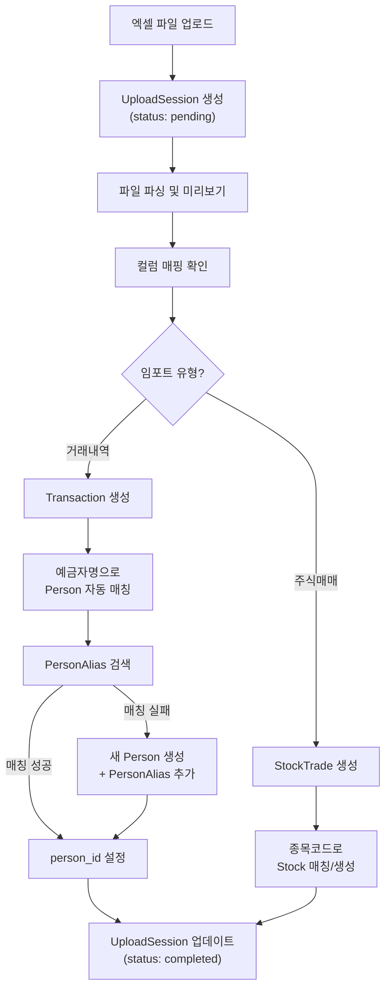

# 01. 데이터모델 분석

> SQLite + SQLAlchemy 기반 자산 추적기 데이터 모델 상세 설계

## 1. 개요

자산 추적기는 **SQLite**를 데이터베이스로, **SQLAlchemy ORM**을 데이터 접근 계층으로 사용합니다.

### 설계 원칙

| 원칙 | 설명 |
|------|------|
| **정수 기반 금액** | 모든 금액은 **원(₩) 단위 정수**로 저장 (부동소수점 오차 방지) |
| **ISO 날짜 형식** | 날짜는 `YYYY-MM-DD`, 시각은 `YYYY-MM-DD HH:MM:SS` 형식 |
| **외래키 무결성** | SQLite `PRAGMA foreign_keys = ON` 활성화 |
| **Cascade 삭제** | 부모 삭제 시 연관 자식 레코드 자동 삭제 |
| **소프트 삭제 미사용** | 단순성을 위해 하드 삭제 사용 |

### 기술 스택

```python
# requirements.txt (관련 부분)
Flask-SQLAlchemy==3.1.1
SQLAlchemy==2.0.x
```

```python
# app.py - 데이터베이스 초기화
from flask_sqlalchemy import SQLAlchemy

db = SQLAlchemy()

def create_app():
    app = Flask(__name__)
    app.config['SQLALCHEMY_DATABASE_URI'] = 'sqlite:///asset_tracker.db'
    app.config['SQLALCHEMY_TRACK_MODIFICATIONS'] = False

    db.init_app(app)

    # SQLite 외래키 활성화
    @app.before_request
    def enable_foreign_keys():
        db.engine.execute("PRAGMA foreign_keys = ON")

    return app
```

---

## 2. 테이블 관계도 (ER 다이어그램)



---

## 3. 테이블 상세 명세

### 3.1 Account (계좌)

은행/증권 계좌 정보를 관리합니다.

| 컬럼명 | 타입 | 제약조건 | 설명 |
|---------|------|----------|------|
| `id` | `Integer` | PK, Auto Increment | 고유 식별자 |
| `name` | `String(100)` | NOT NULL, UNIQUE | 계좌 표시명 (예: "국민은행 급여통장") |
| `bank_name` | `String(50)` | NOT NULL | 은행/증권사명 (예: "국민은행") |
| `account_number` | `String(50)` | NULLABLE | 계좌번호 (선택, 마스킹 저장 가능) |
| `account_type` | `String(20)` | NOT NULL, DEFAULT='bank' | 계좌 유형: `bank`, `stock`, `crypto` |
| `description` | `String(200)` | NULLABLE | 계좌 메모/설명 |
| `created_at` | `DateTime` | NOT NULL, DEFAULT=now | 생성 시각 |
| `updated_at` | `DateTime` | NOT NULL, DEFAULT=now, ON UPDATE=now | 수정 시각 |

```python
class Account(db.Model):
    __tablename__ = 'accounts'

    id = db.Column(db.Integer, primary_key=True)
    name = db.Column(db.String(100), nullable=False, unique=True)
    bank_name = db.Column(db.String(50), nullable=False)
    account_number = db.Column(db.String(50), nullable=True)
    account_type = db.Column(db.String(20), nullable=False, default='bank')
    description = db.Column(db.String(200), nullable=True)
    created_at = db.Column(db.DateTime, nullable=False, default=datetime.utcnow)
    updated_at = db.Column(db.DateTime, nullable=False, default=datetime.utcnow, onupdate=datetime.utcnow)

    # Relationships
    transactions = db.relationship('Transaction', backref='account',
                                   lazy='dynamic', cascade='all, delete-orphan')

    def to_dict(self):
        return {
            'id': self.id,
            'name': self.name,
            'bank_name': self.bank_name,
            'account_number': self.account_number,
            'account_type': self.account_type,
            'description': self.description,
            'created_at': self.created_at.isoformat(),
            'updated_at': self.updated_at.isoformat()
        }
```

> [!NOTE]
> `account_type`은 향후 증권 계좌(`stock`), 암호화폐 계좌(`crypto`) 지원을 위해 설계되었습니다.

---

### 3.2 Person (인물)

거래 상대방(예금자/출금자) 정보를 관리합니다.

| 컬럼명 | 타입 | 제약조건 | 설명 |
|---------|------|----------|------|
| `id` | `Integer` | PK, Auto Increment | 고유 식별자 |
| `name` | `String(100)` | NOT NULL, UNIQUE | 대표 이름 |
| `notes` | `Text` | NULLABLE | 인물 메모 |
| `created_at` | `DateTime` | NOT NULL, DEFAULT=now | 생성 시각 |
| `updated_at` | `DateTime` | NOT NULL, DEFAULT=now, ON UPDATE=now | 수정 시각 |

```python
class Person(db.Model):
    __tablename__ = 'persons'

    id = db.Column(db.Integer, primary_key=True)
    name = db.Column(db.String(100), nullable=False, unique=True)
    notes = db.Column(db.Text, nullable=True)
    created_at = db.Column(db.DateTime, nullable=False, default=datetime.utcnow)
    updated_at = db.Column(db.DateTime, nullable=False, default=datetime.utcnow, onupdate=datetime.utcnow)

    # Relationships
    aliases = db.relationship('PersonAlias', backref='person',
                              lazy='dynamic', cascade='all, delete-orphan')
    transactions = db.relationship('Transaction', backref='person',
                                   lazy='dynamic', cascade='all, delete-orphan')
    stock_trades = db.relationship('StockTrade', backref='person',
                                   lazy='dynamic', cascade='all, delete-orphan')

    def to_dict(self, include_aliases=False):
        data = {
            'id': self.id,
            'name': self.name,
            'notes': self.notes,
            'created_at': self.created_at.isoformat(),
            'updated_at': self.updated_at.isoformat()
        }
        if include_aliases:
            data['aliases'] = [a.alias for a in self.aliases]
        return data
```

---

### 3.3 PersonAlias (인물 별칭)

한 인물이 여러 이름으로 거래할 수 있으므로, 별칭을 별도 테이블로 관리합니다.

| 컬럼명 | 타입 | 제약조건 | 설명 |
|---------|------|----------|------|
| `id` | `Integer` | PK, Auto Increment | 고유 식별자 |
| `person_id` | `Integer` | FK → persons.id, NOT NULL | 소속 인물 |
| `alias` | `String(100)` | NOT NULL, UNIQUE | 별칭 (예금자명 등) |
| `created_at` | `DateTime` | NOT NULL, DEFAULT=now | 생성 시각 |

```python
class PersonAlias(db.Model):
    __tablename__ = 'person_aliases'

    id = db.Column(db.Integer, primary_key=True)
    person_id = db.Column(db.Integer, db.ForeignKey('persons.id', ondelete='CASCADE'), nullable=False)
    alias = db.Column(db.String(100), nullable=False, unique=True)
    created_at = db.Column(db.DateTime, nullable=False, default=datetime.utcnow)
```

> [!IMPORTANT]
> `alias` 컬럼의 UNIQUE 제약은 **전체 시스템에서 하나의 별칭이 하나의 인물에만** 연결되도록 보장합니다. 엑셀 임포트 시 예금자명으로 인물을 자동 매칭할 때 이 제약이 핵심적으로 활용됩니다.

---

### 3.4 Transaction (거래내역)

은행 계좌 입출금 거래 기록을 저장합니다.

| 컬럼명 | 타입 | 제약조건 | 설명 |
|---------|------|----------|------|
| `id` | `Integer` | PK, Auto Increment | 고유 식별자 |
| `account_id` | `Integer` | FK → accounts.id, NOT NULL | 거래 계좌 |
| `person_id` | `Integer` | FK → persons.id, NULLABLE | 거래 상대방 (매칭 전 NULL 가능) |
| `upload_session_id` | `Integer` | FK → upload_sessions.id, NULLABLE | 임포트 세션 (수동 입력 시 NULL) |
| `transaction_date` | `Date` | NOT NULL | 거래일 |
| `transaction_type` | `String(10)` | NOT NULL | `deposit`(입금) / `withdrawal`(출금) |
| `amount` | `Integer` | NOT NULL | 거래 금액 (항상 양수, 원 단위) |
| `balance` | `Integer` | NULLABLE | 거래 후 잔액 (원 단위) |
| `description` | `String(200)` | NULLABLE | 거래 적요/설명 |
| `memo` | `String(200)` | NULLABLE | 사용자 메모 |
| `created_at` | `DateTime` | NOT NULL, DEFAULT=now | 생성 시각 |

```python
class Transaction(db.Model):
    __tablename__ = 'transactions'

    id = db.Column(db.Integer, primary_key=True)
    account_id = db.Column(db.Integer, db.ForeignKey('accounts.id', ondelete='CASCADE'), nullable=False)
    person_id = db.Column(db.Integer, db.ForeignKey('persons.id', ondelete='SET NULL'), nullable=True)
    upload_session_id = db.Column(db.Integer, db.ForeignKey('upload_sessions.id', ondelete='SET NULL'), nullable=True)
    transaction_date = db.Column(db.Date, nullable=False)
    transaction_type = db.Column(db.String(10), nullable=False)  # 'deposit' or 'withdrawal'
    amount = db.Column(db.Integer, nullable=False)               # 항상 양수
    balance = db.Column(db.Integer, nullable=True)
    description = db.Column(db.String(200), nullable=True)
    memo = db.Column(db.String(200), nullable=True)
    created_at = db.Column(db.DateTime, nullable=False, default=datetime.utcnow)

    # 인덱스
    __table_args__ = (
        db.Index('idx_tx_date', 'transaction_date'),
        db.Index('idx_tx_account_date', 'account_id', 'transaction_date'),
        db.Index('idx_tx_person', 'person_id'),
    )

    def to_dict(self):
        return {
            'id': self.id,
            'account_id': self.account_id,
            'account_name': self.account.name if self.account else None,
            'person_id': self.person_id,
            'person_name': self.person.name if self.person else None,
            'transaction_date': self.transaction_date.isoformat(),
            'transaction_type': self.transaction_type,
            'amount': self.amount,
            'balance': self.balance,
            'description': self.description,
            'memo': self.memo,
            'created_at': self.created_at.isoformat()
        }
```

> [!WARNING]
> `amount`는 **항상 양수**로 저장합니다. 입금/출금 구분은 `transaction_type` 필드로 합니다. 이렇게 하면 합계 계산 시 실수를 방지할 수 있습니다.

---

### 3.5 Stock (주식 종목)

주식 종목 마스터 정보를 관리합니다.

| 컬럼명 | 타입 | 제약조건 | 설명 |
|---------|------|----------|------|
| `id` | `Integer` | PK, Auto Increment | 고유 식별자 |
| `code` | `String(20)` | NOT NULL, UNIQUE | 종목코드 (예: "005930") |
| `name` | `String(100)` | NOT NULL | 종목명 (예: "삼성전자") |
| `market` | `String(20)` | NULLABLE | 시장 구분: `KOSPI`, `KOSDAQ`, `NASDAQ` 등 |
| `created_at` | `DateTime` | NOT NULL, DEFAULT=now | 생성 시각 |
| `updated_at` | `DateTime` | NOT NULL, DEFAULT=now, ON UPDATE=now | 수정 시각 |

```python
class Stock(db.Model):
    __tablename__ = 'stocks'

    id = db.Column(db.Integer, primary_key=True)
    code = db.Column(db.String(20), nullable=False, unique=True)
    name = db.Column(db.String(100), nullable=False)
    market = db.Column(db.String(20), nullable=True)
    created_at = db.Column(db.DateTime, nullable=False, default=datetime.utcnow)
    updated_at = db.Column(db.DateTime, nullable=False, default=datetime.utcnow, onupdate=datetime.utcnow)

    # Relationships
    trades = db.relationship('StockTrade', backref='stock',
                             lazy='dynamic', cascade='all, delete-orphan')
```

---

### 3.6 StockTrade (주식 매매)

주식 매수/매도 거래 기록을 저장합니다.

| 컬럼명 | 타입 | 제약조건 | 설명 |
|---------|------|----------|------|
| `id` | `Integer` | PK, Auto Increment | 고유 식별자 |
| `person_id` | `Integer` | FK → persons.id, NULLABLE | 거래자 |
| `stock_id` | `Integer` | FK → stocks.id, NOT NULL | 종목 |
| `upload_session_id` | `Integer` | FK → upload_sessions.id, NULLABLE | 임포트 세션 |
| `trade_date` | `Date` | NOT NULL | 거래일 |
| `trade_type` | `String(10)` | NOT NULL | `buy`(매수) / `sell`(매도) |
| `quantity` | `Integer` | NOT NULL | 수량 (주) |
| `price` | `Integer` | NOT NULL | 단가 (원) |
| `total_amount` | `Integer` | NOT NULL | 총 거래금액 (원) |
| `fee` | `Integer` | NOT NULL, DEFAULT=0 | 수수료 (원) |
| `tax` | `Integer` | NOT NULL, DEFAULT=0 | 세금 (원) |
| `memo` | `String(200)` | NULLABLE | 메모 |
| `created_at` | `DateTime` | NOT NULL, DEFAULT=now | 생성 시각 |

```python
class StockTrade(db.Model):
    __tablename__ = 'stock_trades'

    id = db.Column(db.Integer, primary_key=True)
    person_id = db.Column(db.Integer, db.ForeignKey('persons.id', ondelete='SET NULL'), nullable=True)
    stock_id = db.Column(db.Integer, db.ForeignKey('stocks.id', ondelete='CASCADE'), nullable=False)
    upload_session_id = db.Column(db.Integer, db.ForeignKey('upload_sessions.id', ondelete='SET NULL'), nullable=True)
    trade_date = db.Column(db.Date, nullable=False)
    trade_type = db.Column(db.String(10), nullable=False)   # 'buy' or 'sell'
    quantity = db.Column(db.Integer, nullable=False)
    price = db.Column(db.Integer, nullable=False)            # 단가 (원)
    total_amount = db.Column(db.Integer, nullable=False)     # 총액 (원)
    fee = db.Column(db.Integer, nullable=False, default=0)
    tax = db.Column(db.Integer, nullable=False, default=0)
    memo = db.Column(db.String(200), nullable=True)
    created_at = db.Column(db.DateTime, nullable=False, default=datetime.utcnow)

    # 인덱스
    __table_args__ = (
        db.Index('idx_st_date', 'trade_date'),
        db.Index('idx_st_stock_date', 'stock_id', 'trade_date'),
        db.Index('idx_st_person', 'person_id'),
    )

    def to_dict(self):
        return {
            'id': self.id,
            'person_id': self.person_id,
            'person_name': self.person.name if self.person else None,
            'stock_id': self.stock_id,
            'stock_code': self.stock.code if self.stock else None,
            'stock_name': self.stock.name if self.stock else None,
            'trade_date': self.trade_date.isoformat(),
            'trade_type': self.trade_type,
            'quantity': self.quantity,
            'price': self.price,
            'total_amount': self.total_amount,
            'fee': self.fee,
            'tax': self.tax,
            'memo': self.memo,
            'created_at': self.created_at.isoformat()
        }
```

---

### 3.7 UploadSession (업로드 세션)

엑셀 파일 업로드/임포트 이력을 관리합니다.

| 컬럼명 | 타입 | 제약조건 | 설명 |
|---------|------|----------|------|
| `id` | `Integer` | PK, Auto Increment | 고유 식별자 |
| `filename` | `String(200)` | NOT NULL | 저장된 파일명 (UUID 기반) |
| `original_filename` | `String(200)` | NOT NULL | 원본 파일명 |
| `total_rows` | `Integer` | NOT NULL, DEFAULT=0 | 전체 행 수 |
| `success_rows` | `Integer` | NOT NULL, DEFAULT=0 | 성공 행 수 |
| `error_rows` | `Integer` | NOT NULL, DEFAULT=0 | 에러 행 수 |
| `status` | `String(20)` | NOT NULL, DEFAULT='pending' | 상태: `pending`, `processing`, `completed`, `failed` |
| `error_log` | `Text` | NULLABLE | 에러 상세 로그 (JSON 형식) |
| `upload_type` | `String(20)` | NOT NULL, DEFAULT='transaction' | 업로드 유형: `transaction`, `stock_trade` |
| `created_at` | `DateTime` | NOT NULL, DEFAULT=now | 업로드 시각 |

```python
class UploadSession(db.Model):
    __tablename__ = 'upload_sessions'

    id = db.Column(db.Integer, primary_key=True)
    filename = db.Column(db.String(200), nullable=False)
    original_filename = db.Column(db.String(200), nullable=False)
    total_rows = db.Column(db.Integer, nullable=False, default=0)
    success_rows = db.Column(db.Integer, nullable=False, default=0)
    error_rows = db.Column(db.Integer, nullable=False, default=0)
    status = db.Column(db.String(20), nullable=False, default='pending')
    error_log = db.Column(db.Text, nullable=True)
    upload_type = db.Column(db.String(20), nullable=False, default='transaction')
    created_at = db.Column(db.DateTime, nullable=False, default=datetime.utcnow)

    # Relationships
    transactions = db.relationship('Transaction', backref='upload_session', lazy='dynamic')
    stock_trades = db.relationship('StockTrade', backref='upload_session', lazy='dynamic')

    def to_dict(self):
        return {
            'id': self.id,
            'filename': self.filename,
            'original_filename': self.original_filename,
            'total_rows': self.total_rows,
            'success_rows': self.success_rows,
            'error_rows': self.error_rows,
            'status': self.status,
            'upload_type': self.upload_type,
            'created_at': self.created_at.isoformat()
        }
```

---

## 4. 인덱스 전략

### 4.1 인덱스 목록

| 테이블 | 인덱스명 | 컬럼 | 용도 |
|--------|----------|------|------|
| `transactions` | `idx_tx_date` | `transaction_date` | 날짜 범위 조회 (대시보드) |
| `transactions` | `idx_tx_account_date` | `account_id`, `transaction_date` | 계좌별 기간 조회 |
| `transactions` | `idx_tx_person` | `person_id` | 인물별 거래 조회 |
| `stock_trades` | `idx_st_date` | `trade_date` | 날짜 범위 조회 |
| `stock_trades` | `idx_st_stock_date` | `stock_id`, `trade_date` | 종목별 기간 조회 |
| `stock_trades` | `idx_st_person` | `person_id` | 인물별 주식거래 조회 |
| `person_aliases` | (UNIQUE) | `alias` | 별칭 검색 (임포트 시 매칭) |
| `accounts` | (UNIQUE) | `name` | 계좌명 중복 방지 |
| `stocks` | (UNIQUE) | `code` | 종목코드 중복 방지 |

### 4.2 인덱스 설계 근거



> [!TIP]
> SQLite는 단일 파일 DB이므로 인덱스가 너무 많으면 쓰기 성능이 저하될 수 있습니다. 위 인덱스는 **읽기 중심** 워크로드에 최적화되어 있으며, 대량 임포트 시에는 배치 커밋을 활용합니다.

---

## 5. 데이터 무결성 전략

### 5.1 외래키 제약조건



| 관계 | 부모 삭제 시 | 이유 |
|------|-------------|------|
| Account → Transaction | **CASCADE** | 계좌 삭제 시 거래내역도 의미 없음 |
| Person → PersonAlias | **CASCADE** | 인물 삭제 시 별칭도 삭제 |
| Person → Transaction | **SET NULL** | 인물 삭제해도 거래 기록은 보존 |
| Person → StockTrade | **SET NULL** | 인물 삭제해도 주식거래 기록은 보존 |
| Stock → StockTrade | **CASCADE** | 종목 삭제 시 거래 기록도 삭제 |
| UploadSession → Transaction | **SET NULL** | 세션 삭제해도 임포트된 거래는 보존 |
| UploadSession → StockTrade | **SET NULL** | 세션 삭제해도 임포트된 거래는 보존 |

### 5.2 UNIQUE 제약조건

| 테이블 | 컬럼 | 목적 |
|--------|------|------|
| `accounts` | `name` | 동일 이름 계좌 생성 방지 |
| `persons` | `name` | 동일 이름 인물 생성 방지 |
| `person_aliases` | `alias` | 하나의 별칭이 여러 인물에 연결되는 것 방지 |
| `stocks` | `code` | 종목코드 중복 방지 |

### 5.3 SQLite 외래키 활성화

```python
# SQLite는 기본적으로 외래키 체크가 비활성화되어 있음
# 매 연결마다 활성화 필요

from sqlalchemy import event

@event.listens_for(db.engine, "connect")
def set_sqlite_pragma(dbapi_connection, connection_record):
    cursor = dbapi_connection.cursor()
    cursor.execute("PRAGMA foreign_keys=ON")
    cursor.close()
```

> [!CAUTION]
> SQLite에서 `PRAGMA foreign_keys = ON`을 설정하지 않으면 외래키 제약이 **무시**됩니다. 반드시 연결 시마다 설정해야 합니다.

---

## 6. 데이터 흐름도



---

## 7. 마이그레이션 전략

> [!NOTE]
> 초기 버전에서는 **Flask-Migrate (Alembic)** 대신 `db.create_all()`을 사용하여 단순성을 유지합니다. 스키마 변경이 잦아지면 Flask-Migrate 도입을 검토합니다.

```python
# 초기 테이블 생성
with app.app_context():
    db.create_all()
```

### 향후 마이그레이션 도입 시

```bash
# Flask-Migrate 초기화
flask db init
flask db migrate -m "Initial migration"
flask db upgrade
```

---

## 8. 참고: 금액 처리 규칙

| 규칙 | 설명 | 예시 |
|------|------|------|
| 정수 저장 | 모든 금액은 원 단위 정수 | `1000000` (백만 원) |
| 양수 저장 | `amount`는 항상 양수 | 출금 100만원 → `amount=1000000, type='withdrawal'` |
| 부호 없음 | 입출금 구분은 `type` 필드 | `transaction_type='deposit'` or `'withdrawal'` |
| 잔액 선택적 | `balance`는 NULL 허용 | 잔액 정보 없는 엑셀도 임포트 가능 |
| 주식 총액 | `total_amount = price × quantity` | 10,000원 × 100주 = `1000000` |
